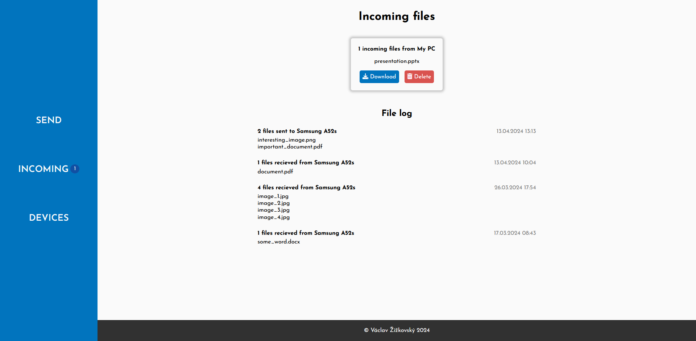

# DropX
DropX is a simple and quick file transferer built in Laravel. The app features easy file sending, device pairing and a transfer history with pagination.
## Installation
First, download PHP to your local machine (for example XAMPP), then you must setup a `.env` file. Just copy the `.env.example`, rename it and fill the variables. For database, I recommend setting `DB_connection` to sqlite and then comment out the other DB variables with `#`. Then open the repository in the command line and run `php artisan migrate --seed`. It is probably also required to generate a unique app key using `php artisan key:generate` command. Finally, to launch the project, run `php artisan serve` and visit localhost:8000 in your browser.

You may also use DropX [online](https://dropx.zizkovsky.eu).
## How does it look

## License
&copy; Václav Žižkovský 2024, released under [MIT license](https://choosealicense.com/licenses/mit/)
